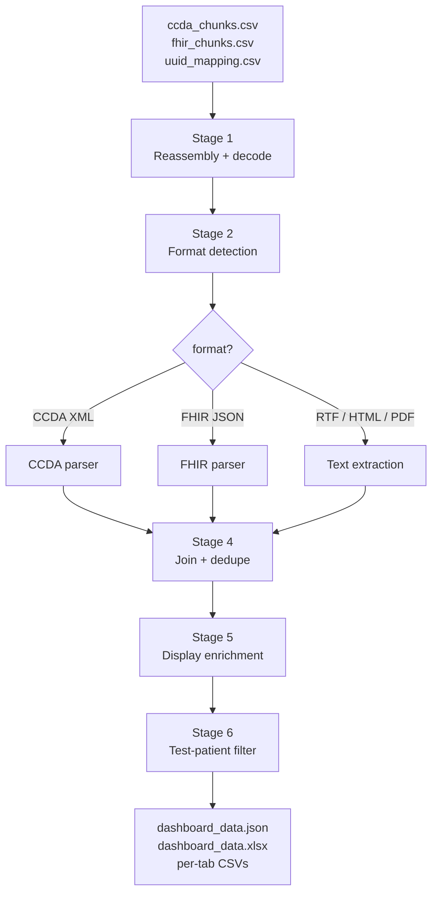

# Architecture

## Pipeline flow

## Module structure

The entire pipeline is a single Python file (`run_pipeline.py`) organized
into labelled sections:

| Section | Purpose |
|---------|---------|
| Part A | Imports & user-configurable constants |
| Part B | Display-enrichment lookup tables (LOINC, SNOMED) |
| Part C | Name cleaning + MRN normalization |
| Part D | Code-walking utilities (CCDA `<translation>`, FHIR `coding[]`) |
| Part E | Format detection + decoding + text strippers |
| Part F | Stage 1 -- reassembly |
| Part G | Stage 2 -- CCDA parsing |
| Part H | Stage 3 -- FHIR parsing (13 resource types) |
| Part I | Stage 4 -- patient deduplication & schema aliasing |
| Part J | Stage 4 -- bundle assembly |
| Part K | Stage 5 -- display enrichment |
| Part L | Stage 6 -- test-patient filter |
| Part M | Output writers (JSON, XLSX, CSV) |
| Part N | `main()` orchestrator |

## Data model

The output bundle is a flat JSON object with these top-level keys:

| Key | Type | Description |
|-----|------|-------------|
| `metadata` | object | Generation timestamp, pipeline version, total patient count |
| `patients` | array | Patient records with demographics + `num_documents` |
| `documents` | array | One record per source document (CCDA, FHIR, RTF, HTML, PDF) with `plain_text` |
| `encounters` | array | Visit / encounter records |
| `problems` | array | Conditions / diagnoses |
| `medications` | array | MedicationRequest, MedicationStatement, MedicationAdministration |
| `procedures` | array | Procedures performed |
| `labs` | array | Laboratory observations |
| `vitals` | array | Vital-sign observations |
| `labs_vitals` | array | Convenience union of `labs` + `vitals` |
| `allergies` | array | AllergyIntolerance records |
| `immunizations` | array | Immunization records |
| `careplans` | array | CarePlan records |
| `diagnostic_reports` | array | DiagnosticReport records |
| `goals` | array | Goal records |
| `notes` | array | One row per CCDA section narrative (title + body + char count) |
| `document_references` | array | FHIR DocumentReference records |

Every clinical record carries a `patient_id` field that joins back to
`patients[].patient_id`.

See [Output schema](schema.md) for per-row field definitions.

## Cross-bundle reference resolution

A real world FHIR export often splits resources across bundles such that a
`MedicationRequest` in bundle A references a `Medication` resource in
bundle B. The same applies to `DocumentReference` -> `Patient`.

Stage 3 handles this with a two-pass design:

1. **Pre-pass**: walk every FHIR bundle once. Build a global
   `medication_index` keyed by Medication resource id, full URL, and
   `Medication/<id>` form. Build a global `docref_pid_map` from
   `DocumentReference.subject.reference` so any document can resolve back
   to a patient.
2. **Main pass**: walk every bundle again. When a `MedicationRequest`'s
   `medicationReference` points outside the current bundle, look it up in
   the global index. When a CCDA / RTF / HTML / PDF document UUID isn't in
   `uuid_mapping.csv`, look it up in `docref_pid_map`.

This is the difference between "most medications have a generic
'medication-12345' display" and "every medication has its RxNorm code,
RxNorm display, and dose". Same for document linkage.
